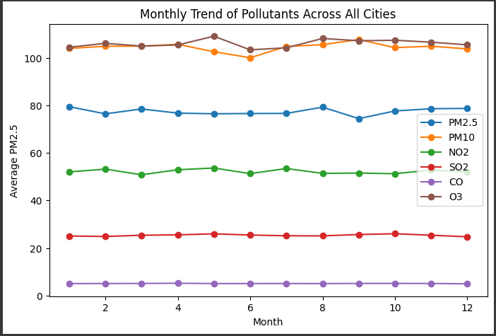
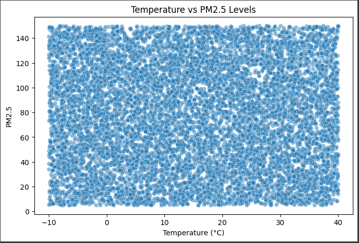
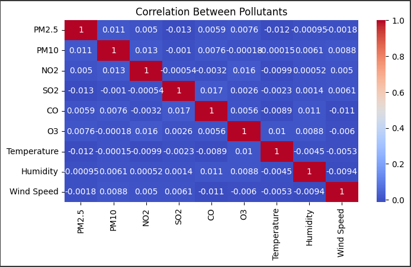
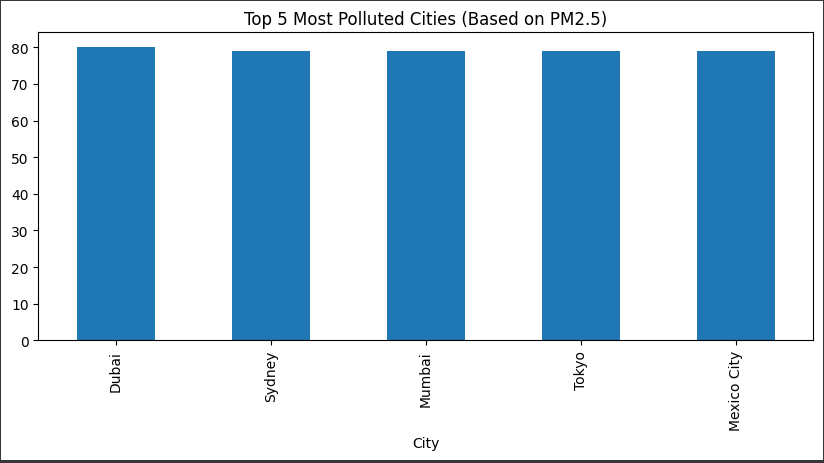
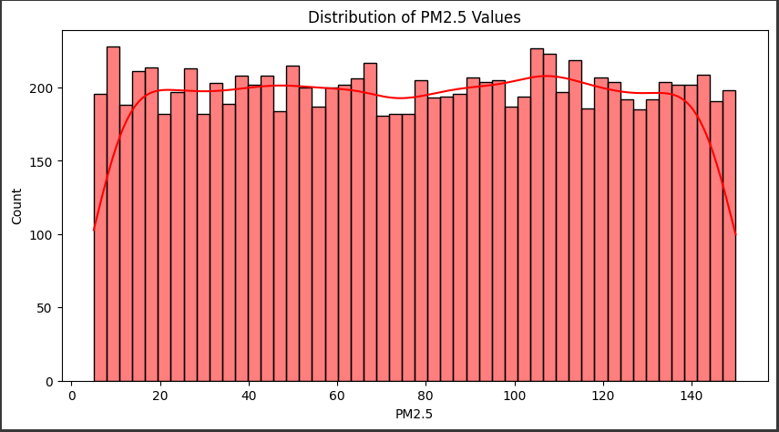

# 🌍 Air Pollution Data Analysis Project

## 📌 Project Overview
This project analyzes **global air quality data** using **Python, Pandas, NumPy, Matplotlib, and Seaborn**.  
It explores pollution levels across cities, evaluates pollutant distributions, detects anomalies, and checks if **temperature or season impacts pollution**.  
The project also estimates a simple **Air Quality Index (AQI)** for different cities.

---

## ⚙️ Technologies Used
- Python 🐍
- Pandas (Data Handling)
- NumPy (Numerical Operations)
- Matplotlib & Seaborn (Visualization)
- Plotly (Interactive Visuals)

---

## 📂 Dataset
- **File**: `global_air_quality_data.csv`  
- **Columns**:  
  - `City`, `Country`  
  - `Date`  
  - `PM2.5`, `PM10`, `NO2`, `SO2`, `CO`, `O3`  
  - `Temperature`, `Humidity`, `Wind Speed`

---

## 🔑 Features Implemented
1. **Data Cleaning & Preprocessing**
   - Duplicate removal
   - Date conversion to `datetime`
   - Handling missing values

2. **Feature Engineering**
   - Extracted `Year`, `Month`, `Season`, `WeekDay`
   - Rolling average for PM2.5
   - Z-score based anomaly detection

3. **Exploratory Data Analysis (EDA)**
   - Average pollution level by city
   - Monthly & seasonal pollution trends
   - Correlation heatmap (pollutants + weather factors)
   - Temperature vs PM2.5 (scatter & regression)
   - Top 5 most polluted cities
   - Distribution of PM2.5
   - Worst pollution day per city

4. **AQI Estimation**
   - Simple AQI = mean of pollutants
   - Ranked cities by AQI
   - Identified best city (least polluted)

---

## 📊 Visualizations

### 1. Monthly PM2.5 Trend

### 2. Temperature vs PM2.5 Scatter

### 3. Correlation Heatmap

### 4. Top 5 Polluted Cities

### 5. PM2.5 Distribution

---

## 📌 Key Insights (from dataset)
1. **Seasonal impact is negligible** – Month-wise PM2.5 variation is very small (range ≈ 5.03 on mean 77.45; ~6.5%).  
2. **Temperature has no real effect** – PM2.5 vs Temperature correlation is nearly zero (**r ≈ -0.012, n=10,000**).  
3. **Overall pollution levels are high** – Average PM2.5 ≈ **77.45**, which is **3.1× higher** than the WHO safe limit (25).  

---

## 🚀 How to Run
1. Clone this repo or copy the code into a Jupyter Notebook / Google Colab.
2. Place the dataset `global_air_quality_data.csv` in the same folder.
3. Run the notebook step by step.
4. Output:
   - Cleaned dataset
   - CSV reports (city averages, AQI, seasonal data, anomalies)
   - PNG charts (saved inside `visual/` folder)

---

## ✅ Future Improvements
- Implement official AQI formula (EPA/WHO breakpoints).
- Build predictive models (forecast pollution using weather).
- Add interactive dashboards (Plotly/Streamlit).

---

## 👤 Author
- **Madhav Ganorkar**  
- Tools: Python, Pandas, NumPy, Matplotlib, Seaborn  
- Contact: [LinkedIn](https://www.linkedin.com/in/madhav-ganorkar)
